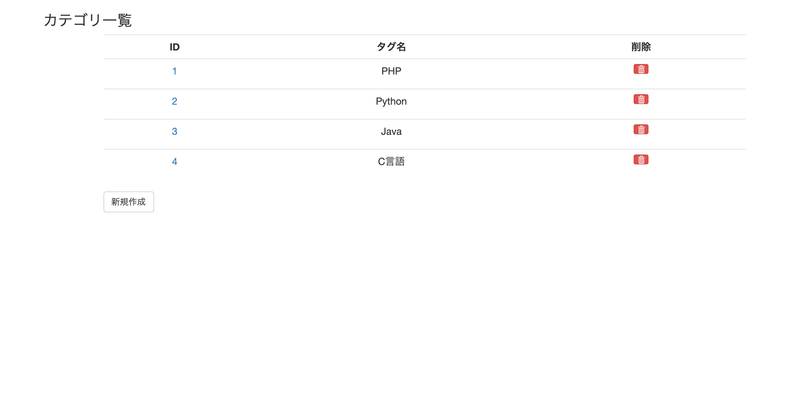
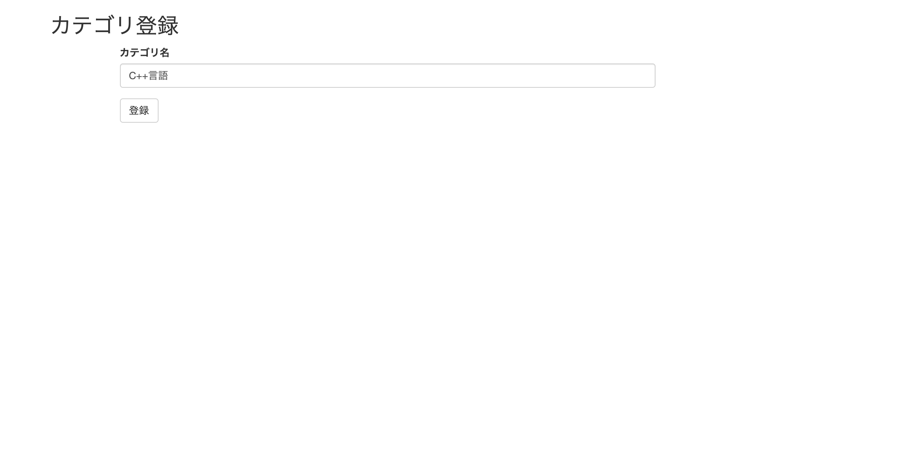
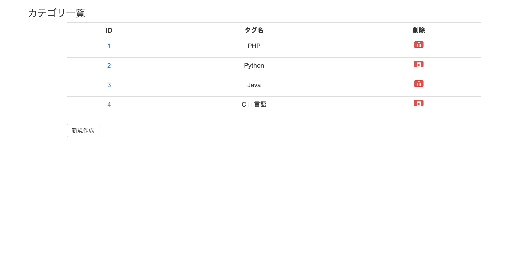
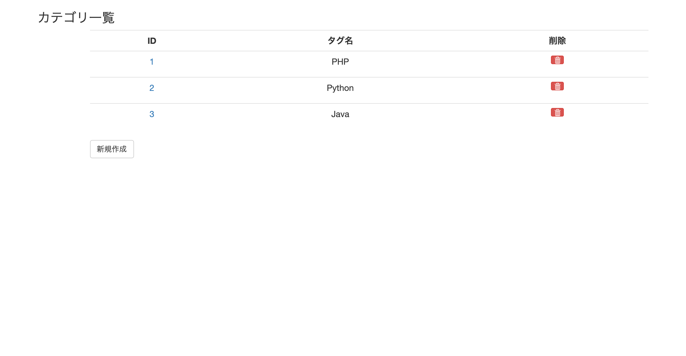
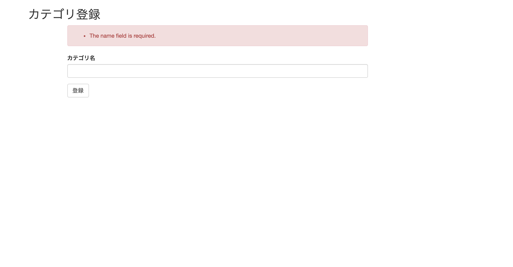
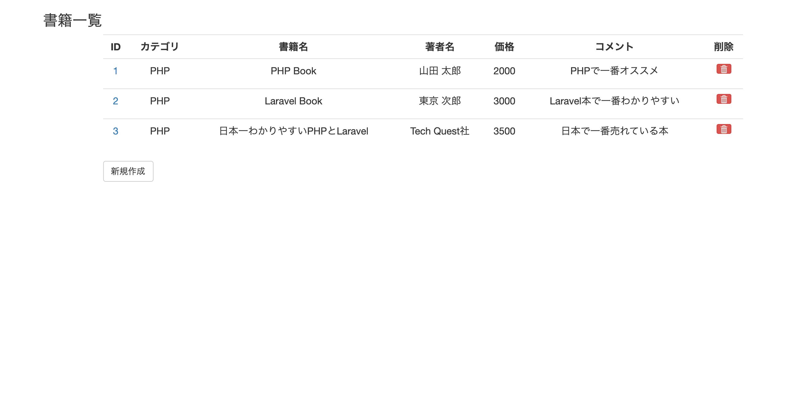
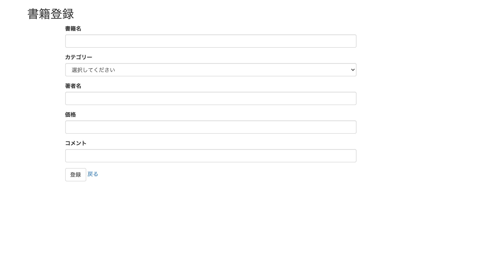
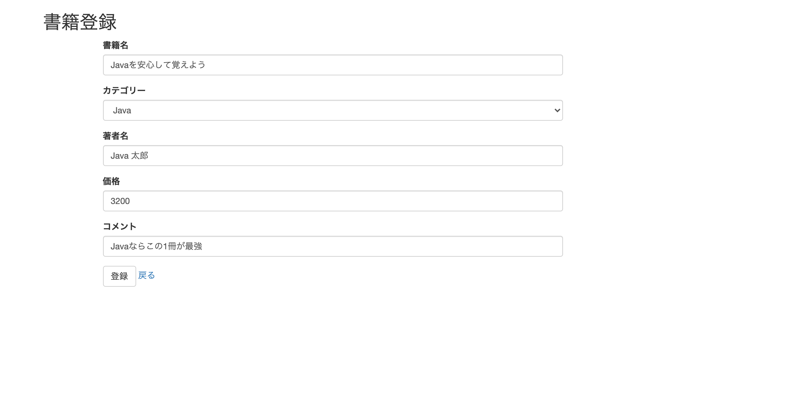

# 書籍管理アプリケーション 機能改修（カテゴリ編）
## 目次

[1. このカリキュラムの目的](#1-このカリキュラムの目的)

[2. カテゴリとは](#2-カテゴリとは)

[3. リレーションシップ（1対多）とは](#3-リレーションシップ1対多とは)

[4. カテゴリ機能の作成](#4-カテゴリ機能の作成)
 - [1. マイグレーションファイルの作成](#1-マイグレーションファイルの作成)
 - [2. テーブル項目の決定と、テーブル作成](2-テーブル項目の決定とテーブル作成)

[5. シーディング（テストデータ）の作成](#5-シーディングテストデータの作成)
 - [1. シーディングファイルの作成](#1-シーディングファイルの作成)
 - [2. シーディングの実行](#2-シーディングの実行)

[6. カテゴリモデル](#6-カテゴリモデル)
 - [1. カテゴリモデルの作成](#1-カテゴリモデルの作成)
 - [2. Categoryクラスにリレーション定義の追加](#2-Categoryクラスにリレーション定義の追加)
 - [3. Bookクラスにリレーションを追加](#3-Bookクラスにリレーションを追加)

[7. カテゴリコントローラーの作成](#7-カテゴリコントローラーの作成)
 - [1. コントローラーの作成](#1-コントローラーの作成)

[8. ルーティングの設定](#8-ルーティングの設定)
 - [1. ルーティング定義の追加](#1-ルーティング定義の追加)

[9. カテゴリ一覧の作成](#9-カテゴリ一覧の作成)
 - [1. CategoryController.phpの作成](#1-CategoryControllerphpの作成)
 - [2. カテゴリ一覧ビューの作成](#2-カテゴリ一覧ビューの作成)
 - [3. カテゴリの新規登録機能の作成](#3-カテゴリの新規登録機能の作成)
 - [4. カテゴリの編集機能の作成](#4-カテゴリの編集機能の作成)
 - [5. カテゴリの削除機能](#5-カテゴリの削除機能)

[10. バリデーション](#10-バリデーション)
 - [1. CategoryRequest.phpの作成](#1-CategoryRequestphpの作成)
 - [2. バリデーションルールの追加](#2-バリデーションルールの追加)
 - [3. 型指定の変更](#3-型指定の変更)
 - [4. エラーメッセージ表示ビューの追加](#4-エラーメッセージ表示ビューの追加)

[11. 書籍にカテゴリを追加する](#11-書籍にカテゴリを追加する)
 - [1. booksテーブルにcategory_idを追加](#1-booksテーブルにcategory_idを追加)
 - [2. 項目「category_id」を追加する記載を追加する。](#2-項目「category_id」を追加する記載を追加する。)
 - [3. カテゴリIDをbooksテーブルに追加する](#3-カテゴリIDをbooksテーブルに追加する)
 - [4. 書籍一覧にカテゴリ名を表示する](#4-書籍一覧にカテゴリ名を表示する)
 - [5. index.blade.phpの修正](#5-indexbladephpの修正)

[12. 書籍登録・編集画面に、カテゴリの選択肢を作成](#12-書籍登録編集画面にカテゴリの選択肢を作成)
 - [1. BookControllerの修正](#1-BookControllerの修正)
 - [2. BookRequestの修正](#2-BookRequestの修正)
 - [3. form.blade.phpの修正](#3-formbladephpの修正)
 - [4. 新規登録画面と編集画面の確認](#4-新規登録画面と編集画面の確認)


## 1. このカリキュラムの目的

laravelのチュートリアルで作成した、書籍管理アプリケーションで実装したBookに対して、`Category（カテゴリ）`を追加する対応を行いましょう。
この対応を経験すると、以下のことを新しく学習できますので、ぜひチャレンジしてください！

1. 既に作成したテーブルに対して、項目を追加する方法が経験出来る
1. 2つのテーブル間の関連性について、理解と必要な作業の経験が出来る（ここでは`1対多`のリレーションシップを経験）

## 2. カテゴリとは

前回のチュートリアルでは、書籍の情報を管理するBook（テーブル名books）を作成しました。
本は、書店などに行けば、技術書、経済書、スポーツ誌、マンガ、などのように、本がどの区分なのかを管理・整理している事がほとんどです。このチュートリアルでは、その本がどんなカテゴリに属するのかを管理したいと思います。
以下のように、各本をそれぞれのカテゴリに登録することとします。

|書籍名|カテゴリ|
|:--:|:--:|
|PHP Book|PHP|
|Laravel Book|PHP|
|日本一わかりやすいPHPとLaravel|PHP|
|JavaによるWebアプリケーション作成入門|Java|
|Pyhtonによるデータ分析入門|Python|
|はじめてのPyhton入門|Python|

上表のように、書籍名：PHPBoookは、`カテゴリ：PHP`に区分けされます。

書籍名：Laravel Bookも`カテゴリ:PHP`に区分けされます。

書籍名：JavaによるWebアプリケーション作成入門は、`カテゴリ：Java`に区分します。


このように、書籍は何かしらの区分（カテゴリ）に仕分けされるようにします。
こうすると、同じカテゴリごとに検索したいなどの要望にも対応が出来ます。

## 3. リレーションシップ（1対多）とは
先程の表では、

    ・ カテゴリ：PHPには3つの書籍
    ・ カテゴリ：Javaには1つの書籍
    ・ カテゴリ：Pythonには2つの書籍

が区分けされています。例えばカテゴリのJavaは、

    ・Javaというある1つのカテゴリに、1つの書籍（Book）が属する

が区分けされています。カテゴリPythonは、

    ・Pythonというある1つのカテゴリに、2つ（複数）の書籍（Book）が属する

のように、2つ区分けされています。カテゴリPHPは、

    ・PHPというある１つのカテゴリに、3つ（複数）の書籍（Book）が属する

のように、3つ区分けされています。

今回の例では書籍数が少ないですが、`ある1つのカテゴリには、様々な複数の書籍が属する`ことになります。

これを言い換えると、`1対多の関係性（リレーションシップ）`といいます。

今回は、categoriesテーブルで管理されているカテゴリが「1」となり、booksテーブルで管理されている本が「多」となる、
ということを覚えてください。

Laravelでこの1対多のリレーションシップの実現は、`Eloquent`の機能を用いれば実現出来ますので、ぜひ活用していきましょう。

## 4. カテゴリ機能の作成

それでは、上記のPHP/Java/Pythonのようなカテゴリ自体を管理するテーブルと、モデル、コントローラーをそれぞれ順番に作成していきます。

#### **1. マイグレーションファイルの作成**

カテゴリテーブル(categories)のテーブルを作成するマイグレーションファイルを作成します。

以下のコマンドを実行してください。
`テーブル名は必ず複数形`とすることを忘れないようにしましょう！

```bash
php artisan make:migration create_categories_table --create=categories
```

以下のメッセージが出力されれば成功です。

```bash
Created Migration: 2020_08_17_070604_create_categories_table
```

以下のファイルが作成されます。

> database/migrations/2020_08_17_070604_create_categories_table.php

```php
<?php

use Illuminate\Database\Migrations\Migration;
use Illuminate\Database\Schema\Blueprint;
use Illuminate\Support\Facades\Schema;

class CreateCategoriesTable extends Migration
{
    /**
     * Run the migrations.
     *
     * @return void
     */
    public function up()
    {
        Schema::create('categories', function (Blueprint $table) {
            $table->id();
            $table->timestamps();
        });
    }

    /**
     * Reverse the migrations.
     *
     * @return void
     */
    public function down()
    {
        Schema::dropIfExists('categories');
    }
}
```

#### **2. テーブル項目の決定と、テーブル作成**

それではここでカテゴリテーブルにはどんな項目を保持するかを考えてみます。
先程のプログラムの書籍達に、PHP/Java/Python、のようにカテゴリの名前をデータとして持てば良いと判断出来ますので、2020_08_17_070604_create_categories_table.phpのupメソッドを以下のように修正します。

> 2020_08_17_070604_create_categories_table.php
```php
    public function up()
    {
        Schema::create('cagtegories', function (Blueprint $table) {
            $table->id();
            $table->string('name');
            $table->timestamps();
        });
    }
```

nameという項目名を追加し、型をstringとします。
これで、カテゴリ名を保存するテーブルを作成する準備が整いました。
以下のコマンドを実行し、テーブルを作成しましょう。

```bash
php artisan migrate
```

以下のメッセージが出力されれば成功です。

```bash
Migrating: 2020_08_17_070604_create_categories_table
Migrated:  2020_08_17_070604_create_categories_table (0.09 seconds)
```

mysqlにも接続して、テーブル名「categories」が作成されたことを確認します。
まずはMySQLに接続しましょう。接続方法は以下リンクの`3. MySQLへのログイン`を参照してください。

[MySQLのインストール手順](/web_application/laravel_tutorial/install_mysql.md)

MySQLへ接続したら、以下のコマンドを実行します。データベースを選択します。
書籍管理アプリでは、データベースはsampleを利用しているのでしたね。

```sql
mysql> use sample;
```

次に、sampleデータベースに存在しているテーブルの一覧を表示するコマンドを実行しましょう。以下のコマンドを実行します。

```sql
mysql> show tables;
```

以下の通り、categoriesテーブルが作成された事が確認できます。

```sql
+------------------+
| Tables_in_sample |
+------------------+
| books            |
| categories       |
| failed_jobs      |
| migrations       |
| users            |
+------------------+
5 rows in set (0.00 sec)
```

作成されているのが確認できましたか？

次に以下のコマンドで、カテゴリテーブルの項目にid、name、created_at、updated_atの項目が作成されているかを確認します。

```sql
mysql> show columns from categories;
```

以下のようにターミナルに表示されます。テーブルの項目はきちんと作成されたでしょうか？

```sql
+------------+---------------------+------+-----+---------+----------------+
| Field      | Type                | Null | Key | Default | Extra          |
+------------+---------------------+------+-----+---------+----------------+
| id         | bigint(20) unsigned | NO   | PRI | NULL    | auto_increment |
| name       | varchar(255)        | NO   |     | NULL    |                |
| created_at | timestamp           | YES  |     | NULL    |                |
| updated_at | timestamp           | YES  |     | NULL    |                |
+------------+---------------------+------+-----+---------+----------------+
```

以上が、カテゴリテーブル（categories）を作成する手順です。


## 5. シーディング（テストデータ）の作成

作成したカテゴリテーブルに、テストデータを登録しましょう。

#### 1. シーディングファイルの作成
以下のArtisanのコマンドを実行します。

```bash
php artisan make:seeder CategoriesTableSeeder
```

以下のメッセージが出力されれば成功です。

```sql
Seeder created successfully.
```

`database/seeds`ディレクトリにCategoriesTableSeeder.phpが作成されます。
> database/seeds/CategoriesTableSeeder.php
```php
<?php

use Illuminate\Database\Seeder;

class CategoriesTableSeeder extends Seeder
{
    /**
     * Run the database seeds.
     *
     * @return void
     */
    public function run()
    {
        //
    }
}
```

categoriesテーブルに、以下のレコードを登録します。

**categoriesテーブル**

|id|name|created_at|updated_at|
|:--:|:--:|:--:|:--:|
|1|PHP|現在時刻|現在時刻|
|2|Python|現在時刻|現在時刻|
|3|Java|現在時刻|現在時刻|

上記レコードを登録するため、シーダーファイルを以下の通りに修正します。
runメソッド内部を修正します。

> database/seeds/CategoriesTableSeeder.php

```php
<?php

use Illuminate\Database\Seeder;

class CategoriesTableSeeder extends Seeder
{
    /**
     * Run the database seeds.
     *
     * @return void
     */
    public function run()
    {
        // categoriesテーブルのデータをクリアする
        DB::table('categories')->truncate();

        // 初期データを用意する（列名をキーとする連想配列で用意する）
        $categories = [
            [
                'name' => 'PHP',
            ],
            [
                'name' => 'Python',
            ],
            [
                'name' => 'Java',
            ]
        ];

        // テストデータを登録する
        foreach ($categories as $category) {
            \App\Category::create($category);
        }
    }
}
```

さらにDatabaseSeeder.phpのrunメソッドを以下のように修正します。runメソッド内でcallしたクラスが、シーディングコマンドで実行されるようになります。

なお、BooksTableSeederを読み込む設定はそのままにしましょう。
既に作成済みのBooksテーブル用のシーディングで、データを再度作るようにします。

> database/seeds/DatabaseSeeder.php
```php
public function run()
{
     // BooksTableSeederを読み込むように指定
     $this->call(BooksTableSeeder::class);

     // CategoriesTableSeederを読み込むように指定
     $this->call(CategoriesTableSeeder::class);
}
```

#### 2. シーディングの実行
シーディングを実行するにはArtisanの`db:seed`コマンドを実行します。

```bash
php artisan db:seed
```

以下のメッセージが表示されたら成功です。

```sql
Seeding: BooksTableSeeder
Seeded:  BooksTableSeeder (0.19 seconds)
Seeding: CategoriesTableSeeder
Seeded:  CategoriesTableSeeder (0.07 seconds)
Database seeding completed successfully.
```

実行が完了したら、SQLでテーブルデータが保存をされたかを確認しましょう。
まず、categoriesテーブルを確認します。select文を実行します。

```sql
select * from categories;
```

以下のようにデータが格納されていれば成功です。

```sql
+----+--------+---------------------+---------------------+
| id | name   | created_at          | updated_at          |
+----+--------+---------------------+---------------------+
|  1 | PHP    | 2020-08-18 01:58:04 | 2020-08-18 01:58:04 |
|  2 | Python | 2020-08-18 01:58:04 | 2020-08-18 01:58:04 |
|  3 | Java   | 2020-08-18 01:58:04 | 2020-08-18 01:58:04 |
+----+--------+---------------------+---------------------+
3 rows in set (0.00 sec)
```

booksテーブルも確認しましょう、select文を実行します。

```sql
mysql> select * from books;
```

以下のようにデータが格納されていれば成功です。

```sql
+----+------------------------------------------+---------------+-------+---------------------------------------+---------------------+---------------------+
| id | title                                    | author        | price | comment                               | created_at          | updated_at          |
+----+------------------------------------------+---------------+-------+---------------------------------------+---------------------+---------------------+
|  1 | PHP Book                                 | 山田 太郎     |  2000 | PHPで一番オススメ                     | 2020-08-18 01:58:04 | 2020-08-18 01:58:04 |
|  2 | Laravel Book                             | 東京 次郎     |  3000 | Laravel本で一番わかりやすい           | 2020-08-18 01:58:04 | 2020-08-18 01:58:04 |
|  3 | 日本一わかりやすいPHPとLaravel           | Tech Quest社  |  3500 | 日本で一番売れている本                | 2020-08-18 01:58:04 | 2020-08-18 01:58:04 |
+----+------------------------------------------+---------------+-------+---------------------------------------+---------------------+---------------------+
3 rows in set (0.00 sec)
```

以上で、シーディングによるデータに準備が整いました。

## 6. カテゴリモデル

次に、カテゴリモデル（Category）を作成しましょう。

#### **1. カテゴリモデルの作成**

以下のコマンドを実行します。カテゴリ名は`単数形`です！

```bash
php artisan make:model Category
```

以下のメッセージが出力されれば成功です。

```bash
Model created successfully.
```

以下ディレクトリに、Category.phpが作成されたことを確認します。

> app/Category.php
```php
<?php

namespace App;

use Illuminate\Database\Eloquent\Model;

class Category extends Model
{
    //
}
```

これでモデルCategoryが作成されたことになりますが、ここで行わなければならない事があります。それは、CategoryとBookとの2つのテーブル間にリレーション関係の定義する必要があります。
冒頭の「リレーションシップ（1対多）とは」で、カテゴリと書籍の関係は、`1対多`となるとお話しましたが、その定義をモデルに記載します。
これを行えば、例えば,

`「カテゴリ名がPythonの書籍を、すべて検索したい」`

といった機能を実現出来ます。

#### **2. Categoryクラスにリレーション定義の追加**

それでは1対多を実現するコードを書いていきましょう。

> app/Category.php
```php
class Category extends Model
{
    public function books()
    {
        return $this->hasMany('App\Book');
    }
}
```

モデルCategoryクラスに、booksメソッドを定義します。
これは今回の場合、

    Category : Book = 1 : 多

のため、多となるBookを複数形としてメソッド名`books()`とします。

次にメソッドの中は、

    return $this->hasMany('App\Book');

と定義します。`$thisは疑似変数`といいますが、ここでは`モデルCategoryクラス自身`のことを指します。

次のhasManyメソッドが1対多を実現するためのメソッドで、第一引数に（'App\Book'）と定義しています。これはモデルBookの相対パスです（Appディレクトリ直下にBookモデルがある）。

これにより、1対多を実現しています。理解出来ましたでしょうか？
もし難しければ以下のような英文で覚えてみましょう。

    Category has many books. （カテゴリは、多くの書籍を持つ）
    → Category（自モデル名、$this）、has many （hasManyメソッド）、books（メソッド名とhasManyの第一引数）

このようにして「カテゴリは、多くの書籍を持つ」というリレーション構造を実現することが出来ます。

#### **3. Bookクラスにリレーションを追加**

先程はCateogoryクラスにリレーションを追加しました。
逆に、BookクラスにCategoryへのリレーションを追加したいと思います。
基本的に`１対多のリレーションシップの定義は先程のhasManyとセットで対応`します。

まずは、実際にBookモデルを以下の通りに修正します。

> app/Book.php
```php
<?php

namespace App;

use Illuminate\Database\Eloquent\Model;

class Book extends Model
{
    public function category()
    {
        return $this->belongsTo('App\Category');
    }
}
```

今度は`belongsTo`で定義します。メソッドのcategoryは単数形である事に注意してください。

直訳すると「本はカテゴリに属しています」という意味合いになります。さて、この定義を追加したことでのメリットは、実際に本に付与したカテゴリの名前を書籍の一覧画面に表示する時に生きてきますので、その時に解説します！

このようなhasManyやbelongsToなどの2つのテーブル間のリレーションシップ定義は他にもありますので、インターネットでぜひ検索してみましょう。

## 7. カテゴリコントローラーの作成

カテゴリのテーブルとモデルの準備が整いましたので、次はコントローラーの作成に移ります。

#### **1. コントローラーの作成**

以下のコマンドで、コントローラーを作成してください。

```bash
php artisan make:controller CategoryController
```

以下のメッセージが表示されたら成功です。

```bash
Controller created successfully.
```

以下のディレクトリ配下に、カテゴリコントローラーが作成されたかを確認します。

  > app/Http/Controllers/CategoryController.php

```php
<?php

namespace App\Http\Controllers;

use Illuminate\Http\Request;

class CategoryController extends Controller
{
    //
}
```

ここで一旦、ルーティングの設定に移ります。

## 8. ルーティングの設定

カテゴリを画面から登録、編集、削除が出来るようにするためには、先程作成したコントローラーで、CRUDをコントロールしますが、ルーティングの設定も必要になります。

#### **1. ルーティング定義の追加**

以下のようにweb.phpにルーティング定義を追加します。

> routes/web.php

```php
    Route::resource('book', 'BookController');
    // 以下のルーティング設定を追加します。
    Route::resource('category', 'CategoryController');
```

一旦定義が正しく追加されたかを以下のコマンドで確認しましょう。

```bash
php artisan route:list
```

以下のように表示がされたかを確認しましょう。

```bash
+--------+-----------+--------------------------+------------------+-------------------------------------------------+------------+
| Domain | Method    | URI                      | Name             | Action                                          | Middleware |
+--------+-----------+--------------------------+------------------+-------------------------------------------------+------------+
|        | GET|HEAD  | api/user                 |                  | Closure                                         | api        |
|        |           |                          |                  |                                                 | auth:api   |
|        | GET|HEAD  | book                     | book.index       | App\Http\Controllers\BookController@index       | web        |
|        | POST      | book                     | book.store       | App\Http\Controllers\BookController@store       | web        |
|        | GET|HEAD  | book/create              | book.create      | App\Http\Controllers\BookController@create      | web        |
|        | GET|HEAD  | book/{book}              | book.show        | App\Http\Controllers\BookController@show        | web        |
|        | PUT|PATCH | book/{book}              | book.update      | App\Http\Controllers\BookController@update      | web        |
|        | DELETE    | book/{book}              | book.destroy     | App\Http\Controllers\BookController@destroy     | web        |
|        | GET|HEAD  | book/{book}/edit         | book.edit        | App\Http\Controllers\BookController@edit        | web        |
|        | GET|HEAD  | category                 | category.index   | App\Http\Controllers\CategoryController@index   | web        |
|        | POST      | category                 | category.store   | App\Http\Controllers\CategoryController@store   | web        |
|        | GET|HEAD  | category/create          | category.create  | App\Http\Controllers\CategoryController@create  | web        |
|        | GET|HEAD  | category/{category}      | category.show    | App\Http\Controllers\CategoryController@show    | web        |
|        | PUT|PATCH | category/{category}      | category.update  | App\Http\Controllers\CategoryController@update  | web        |
|        | DELETE    | category/{category}      | category.destroy | App\Http\Controllers\CategoryController@destroy | web        |
|        | GET|HEAD  | category/{category}/edit | category.edit    | App\Http\Controllers\CategoryController@edit    | web        |
+--------+-----------+--------------------------+------------------+-------------------------------------------------+------------+

```

categoryのルーティング設定が追加されたことを確認します。
ルーティングの詳細は以下のリンクを参照下さい。

[ルーティングについて](/web_application/laravel_tutorial/about_routes.md)

## 9. カテゴリ一覧の作成
それでは、再びカテゴリコントローラー(CategoryController.php)に戻ります。
まずはカテゴリの一覧画面を作成し、シーディングで登録したデータが、画面上で表示されるかを確認します。

#### **1. CategoryController.phpの作成**

まず、CategoryController.phpにindexメソッドを追加して、以下の処理を作成します。

 1. カテゴリデータを、categoriesテーブルから取得
 1. 取得したデータを、category/index.blade.phpに、カテゴリデータを渡し、表示する

という処理を実装します。それでは実際に作成しましょう。

> app/Http/Controllers/CategoryController.php

```php
<?php

namespace App\Http\Controllers;

use Illuminate\Http\Request;
use App\Category;

class CategoryController extends Controller
{
    public function index(){

        // DBよりCategoryテーブルの値を全て取得
        $categories = Category::all();

        // 取得した値をビュー「category/index」に渡す
        return view('category/index', compact('categories'));
    }
}
```

作成が完了したら、viewの作成に移ります。

#### **2.-カテゴリ一覧ビューの作成**

それではindex.blade.phpを作成していきますが、書籍管理のBookを参考にし、各画面で共通的に利用するbladeファイルもこのタイミングで作成します。まずは、layout.blade.phpから作成しましょう。

1. resources/viewsフォルダの下に、`フォルダ名：category`、を作成します。
1. 作成した後、categoryフォルダの中に、`ファイル：layout.blade.php`、を作成します。以下の通りに作成してください。

> resources/views/category/layout.blade.php

```php
<head>
    <title>Category</title>
    <link rel="stylesheet" href="https://maxcdn.bootstrapcdn.com/bootstrap/3.3.7/css/bootstrap.min.css">
</head>
@yield('content')
```

次に、同じく`resources/views/category/`の直下に、index.blade.phpを作成しましょう。

> resources/views/category/index.blade.php

```php
@extends('category/layout')
@section('content')
<div class="container ops-main">
    <div class="row">
        <div class="col-md-12">
            <h3 class="ops-title">カテゴリ一覧</h3>
        </div>
    </div>
    <div class="row">
        <div class="col-md-11 col-md-offset-1">
            <table class="table text-center">
                <tr>
                    <th class="text-center">ID</th>
                    <th class="text-center">タグ名</th>
                    <th class="text-center">削除</th>
                </tr>
                @foreach($categories as $category)
                <tr>
                    <td>
                        <a href="/category/{{ $category->id }}/edit">{{ $category->id }}</a>
                    </td>
                    <td>{{ $category->name }}</td>
                    <td>
                        <form action="/category/{{ $category->id }}" method="post">
                            <input type="hidden" name="_method" value="DELETE">
                            <input type="hidden" name="_token" value="{{ csrf_token() }}">
                            <button type="submit" class="btn btn-xs btn-danger" aria-label="Left Align"><span
                                    class="glyphicon glyphicon-trash"></span></button>
                        </form>
                    </td>
                </tr>
                @endforeach
            </table>
            <div><a href="/category/create" class="btn btn-default">新規作成</a></div>
        </div>
    </div>
</div>
@endsection
```

これで、カテゴリ一覧を表示させる準備が出来ました。
ここでサーバーを起動して、カテゴリ一覧が表示されるかを確認します。
以下のコマンドを実行し、サーバーを起動します。起動手順は以下を参照しましょう。

[laravelサーバー起動手順](/web_application/laravel_tutorial/start_server.md)


以下が表示されれば成功です。

```bash
Laravel development server started: http://localhost:8000
```

サーバーが起動出来たら、お使いのパソコンのブラウザ（Google Chrome等)のアドレス欄に、以下のアドレスをコピーしてアクセスしましょう。

http://localhost:8000/category

上記URLにアクセスすると、シーディングで登録したカテゴリのデータが一覧として表示された事がわかるはずです。以下の通りに表示されていればOKです。

> カテゴリ一覧画面


サーバーは、利用が終わったら停止しましょう。
ターミナル上で、「Control + C」を押せばサーバーは停止します。

#### **3. カテゴリの新規登録機能の作成**

カテゴリを新たに登録するための機能を作成しましょう。
まずは、CategoryControllerに、
 1. 新しくカテゴリを登録する画面に遷移させるためのcreateメソッド
 1. 上記で入力したカテゴリ情報をデータベースへ保存する処理を記載したstoreメソッド

の2つを追加しましょう。
先程CategoryController.phpにて追加した、indexメソッドの下に追加します。

> app/Http/Controllers/CategoryController.php
```php
<?php

namespace App\Http\Controllers;

use Illuminate\Http\Request;
use App\Category;

class CategoryController extends Controller
{
    public function index()
    {
        // DBよりCategoryテーブルの値を全て取得
        $categories = Category::all();

        // 取得した値をビュー「category/index」に渡す
        return view('category/index', compact('categories'));
    }

    public function create()
    {
        // 新規画面と編集画面で共通したbladeファイルを用意するため、空のCategoryインスタンスをbladeへ渡す。
        // blade側にcategoryを渡さないとエラーとなるための処置
        $category = new Category();
        return view('category/create', compact('category'));
    }

    public function store(Request $request)
    {
        $category = new Category();
        $category->name = $request->name;
        // categoriesテーブルにデータを新たに登録します
        $category->save();
        return redirect("/category");
    }
}
```

新規登録画面を作成します、書籍管理と同じく、新規画面と後ほど作成する編集画面はほぼ同じ画面構成となりますので、予め両方で利用ができるようにbladeファイルを作成しましょう。

`form.blade.php`をcategoryフォルダの配下に作成します。

> resources/views/category/form.blade.php

```php
<div class="container ops-main">
    <div class="row">
        <div class="col-md-6">
            <h2> タグ登録</h2>
        </div>
    </div>
    <div class="row">
        <div class="col-md-8 col-md-offset-1">
            @if($target == 'store')
            <form action="/category" method="post">
                @elseif($target == 'update')
                <form action="/category/{{ $category-id }}" method="post">
                    <!-- updateメソッドにはPUTメソッドがルーティングされているので、PUTにする -->
                    <input type="hidden" name="_method" value="PUT">
                    @endif
                    <input type="hidden" name="_token" value="{{ csrf_token() }}">
                    <div class="form-group">
                        <label for="title">タグ名</label>
                        <input type="text" class="form-control" name="title" value="{{ $category->name }}">
                    </div>
                    <button type="submit" class="btn btn-default">登録</button>
                </form>
        </div>
    </div>
</div>
```

categoryフォルダの配下に、新規作成画面の`create.blade.php`を作成します。

>resources/views/category/create.blade.php
```php
@extends('category/layout')
@section('content')
@include('category/form', ['target' => 'store'])
@endsection
```

create.blade.phpの@includeで、form.blade.phpを読み込みます。
また変数targetにstoreをセットする事で、新規作成の場合と編集の場合でformタグが分岐条件によって変化するようになります。storeの場合は新規作成のformへと切り替わります。

これで、カテゴリ新規登録画面の完成です。

サーバーを起動して、動作を確認しましょう。起動手順は以下を確認してください。

[laravelサーバー起動手順](/web_application/laravel_tutorial/start_server.md)

```bash
以下が表示されれば成功です。
Laravel development server started: http://localhost:8000
```

サーバーが起動出来たら、お使いのパソコンのブラウザ（Google Chrome等)のアドレス欄に、以下のアドレスをコピーしてアクセスしましょう。

http://localhost:8000/category

上記URLにアクセスすると、カテゴリのデータが一覧表示されます。
画面下部に「新規登録」ボタンがありますので、クリックしましょう。新規登録画面に遷移します。


カテゴリ名に「C言語」と入力して、「登録」ボタンをクリックしましょう。

登録が成功すると、一覧画面に遷移し、4つ目のカテゴリとして、「C言語」が登録出来た事が確認できると思います。



サーバーは、利用が終わったら停止しましょう。
ターミナル上で、「Control + C」を押せばサーバーは停止します。

以上で、新規登録画面の実装が完了しました。

#### **4. カテゴリの編集機能の作成**

カテゴリの名称を変更したい場合の、編集画面を作成します。
CategoryControllerに、
 1. カテゴリを編集する画面に遷移させるためのeditメソッド
 1. 上記で入力したカテゴリ情報をデータベースへ保存する処理を記載したupdateメソッド

の2つを追加しましょう。
先程CategoryController.phpにて追加した、storeメソッドの下に追加します。

> app/Http/Controllers/CategoryController.php

```php
<?php

namespace App\Http\Controllers;

use Illuminate\Http\Request;
use App\Category;

class CategoryController extends Controller
{
    public function index()
    {
        // DBよりCategoryテーブルの値を全て取得
        $categories = Category::all();

        // 取得した値をビュー「category/index」に渡す
        return view('category/index', compact('categories'));
    }

    public function create()
    {
        // 新規画面と編集画面で共通したbladeファイルを用意するため、空のCategoryインスタンスをbladeへ渡す。
        // blade側にcategoryを渡さないとエラーとなるための処置
        $category = new Category();
        return view('category/create', compact('category'));
    }

    public function store(Request $request)
    {
        $category = new Category();
        $category->name = $request->name;
        $category->save();
        return redirect("/category");
    }

    public function edit($id)
    {
        // DBからURIパラメータと同じIDを持つCategoryの情報を取得
        $category = Category::findOrFail($id);

        // 取得した値をビュー「category/edit」に渡す
        return view('category/edit', compact('category'));
    }

    public function update(Request $request, $id)
    {
        $category = Category::findOrFail($id);
        $category->name = $request->name;
        // カテゴリ名を変更して、DBへ保存します
        $category->save();
        return redirect('/category');
    }
}
```

次に編集画面を作成します。編集画面の入力は、新規登録画面と共通していることは先程案内した通りですので、編集画面もform.blade.phpを読み込むようにします

resource/categoryの配下に`edit.blade.php`を作成しましょう。

>　resources/views/category/edit.blade.php
```php
@extends('category/layout')
@section('content')
@include('category/form', ['target' => 'update'])
@endsection
```

これで編集画面の作成は完了です（新規登録画面で予め作っておいてよかったですね！）
では、再びサーバーを起動しましょう。手順は以下を参照してください（そろそろコマンドを覚えてきたでしょうか？）

[laravelサーバー起動手順](/web_application/laravel_tutorial/start_server.md)

以下が表示されれば成功です。
```bash
Laravel development server started: http://localhost:8000
```

サーバーが起動出来たら、お使いのパソコンのブラウザ（Google Chrome等)のアドレス欄に、以下のアドレスをコピーしてアクセスしましょう。

http://localhost:8000/category

上記URLにアクセスすると、カテゴリのデータが一覧表示されます。
項目のIDがリンクになっています。先程C言語で登録しましたが、そのIDをクリックしましょう。

編集画面に遷移します。カテゴリ名を「C言語」から「C++言語」へと名称を変更して、「登録」ボタンをクリックしましょう。



登録が成功すると、一覧画面に遷移し、カテゴリの名称が、「C++言語」へと変更が出来た事が確認できると思います。



サーバーは、利用が終わったら停止しましょう。
ターミナル上で、「Control + C」を押せばサーバーは停止します。

以上で、変更画面の実装が完了しました。


#### **5. カテゴリの削除機能**

カテゴリの削除機能を作成しましょう。
カテゴリの一覧画面にすでに削除ボタンは作成しているので、CategoryControllerにdestroyメソッドを定義します。

> app/Http/Controllers/BookController.php

```php
public function destroy($id)
{
    $book = Book::findOrFail($id);
    $book->delete();

    return redirect("/book");
}
```

では再びサーバーを起動しましょう。サーバーの起動コマンドは新規と編集の確認で行った時と同様ですので、ぜひ覚えてくださいね！では起動したら以下のURLにアクセスしましょう！

http://localhost:8000/category

上記URLにアクセスすると、カテゴリのデータが一覧表示されます。
各カテゴリの最後にゴミ箱のマークがあると思います。そのボタンを押すと、そのカテゴリは削除されますので、先程変更した「C++言語」横の削除のゴミ箱ボタンをクリックしてみましょう。




削除が成功すると、再びカテゴリ一覧へと戻り「C++言語」が削除されていると思います。

以上で、削除処理の実装が完了しました。

## 10. バリデーション

最後にバリデーション（入力内容のチェック）を追加しましょう。
カテゴリを登録・編集を行う時に、カテゴリ名の記入が無い場合はエラーとするようにしていきます。

#### **1. CategoryRequest.phpの作成**

フォームリクエストを作成は、書籍と同じくArtisanの`make:request`を使用します。

```bash
php artisan make:request CategoryRequest
```

以下のように表示されたら成功です。

```bash
Request created successfully.
```

#### **2. バリデーションルールの追加**

`app/Http/Requests`ディレクトリにCategoryRequest.phpが作成されます。
CategoryRequest.phpのauthorizeメソッドと、rulesメソッドを以下のように修正します。

> app/Http/Requests/CategoryRequest.php
```php
<?php

namespace App\Http\Requests;

use Illuminate\Foundation\Http\FormRequest;

class CategoryRequest extends FormRequest
{
    /**
     * Determine if the user is authorized to make this request.
     *
     * @return bool
     */
    public function authorize()
    {
        // trueに変更します
        return true;
    }

    /**
     * Get the validation rules that apply to the request.
     *
     * @return array
     */
    public function rules()
    {
        // return内部の連想配列に、キー名name、値にルールを記載
        return [
            'name' => 'required|string|max:50',
        ];
    }
}
```

> ※authorizeメソッドのreturnは、忘れずにtrueに変更します。
（falseを返した場合は403ステータスコードのレスポンスが返されます。）


連想配列の値のはバリデーションルールを記述します。

|名前|ルール|
|:--:|:--:|
|required|必須入力|
|string|文字列のみ|
|max:50|50文字以下|

バリデーションルールの詳細に関しては公式サイトを参考にしてください。
https://readouble.com/laravel/5.7/ja/validation.html

#### **3. 型指定の変更**

次に`CategoryController.php`のstoreメソッドとupdateメソッドの引数の型指定をRequestからCategoryRequestに書き換えます。

またuse句に、`use App\Http\Requests\CategoryRequest;`を忘れないように定義してください。

> app/Http/Controllers/CategoryController.php
```php
<?php

namespace App\Http\Controllers;

use Illuminate\Http\Request;
use App\Category;
/*
 *  以下のuseを忘れずに記載しましょう
 */
use App\Http\Requests\CategoryRequest;

class CategoryController extends Controller
{
    public function index()
    {
        // DBよりCategoryテーブルの値を全て取得
        $categories = Category::all();

        // 取得した値をビュー「category/index」に渡す
        return view('category/index', compact('categories'));
    }

    public function create()
    {
        // 新規画面と編集画面で共通したbladeファイルを用意するため、空のCategoryインスタンスをbladeへ渡す。
        // blade側にcategoryを渡さないとエラーとなるための処置
        $category = new Category();
        return view('category/create', compact('category'));
    }

    // Request $requestを、CategoryRequest $requestに変更しましょう
    public function store(CategoryRequest $request)
    {
        $category = new Category();
        $category->name = $request->name;
        $category->save();
        return redirect("/category");
    }

    public function edit($id)
    {
        // DBからURIパラメータと同じIDを持つCategoryの情報を取得
        $category = Category::findOrFail($id);

        // 取得した値をビュー「category/edit」に渡す
        return view('category/edit', compact('category'));
    }

    // Request $requestを、CategoryRequest $requestに変更しましょう
    public function update(CategoryRequest $request, $id)
    {
        $category = Category::findOrFail($id);
        $category->name = $request->name;
        $category->save();
        return redirect("/category");
    }

    public function destroy($id)
    {
        $category = Category::findOrFail($id);
        $category->delete();
        return redirect('/category');
    }
}
```

#### **4. エラーメッセージ表示ビューの追加**

これでカテゴリ名を空にしたまま登録や編集しようとすると、エラーとなるのですが、同じ画面にリダイレクトするようになります。
このままでは何が起きているのかわからないので、エラーメッセージを表示するようにしましょう。
`views/category`ディレクトリに`message.blade.php`を作成します。

> resources/views/category/message.blade.php

```php
<div class="row">
    <div class="col-md-12">
    @if ($errors->any())
        <div class="alert alert-danger">
          <ul>
              @foreach ($errors->all() as $error)
                  <li>{{ $error }}</li>
              @endforeach
          </ul>
        </div>
    @endif
    </div>
</div>
```

このmessage.blade.phpを、form.blade.phpに組み込みます。

> resources/views/category/form.blade.php

```bash
<div class="container ops-main">
    <div class="row">
        <div class="col-md-6">
            <h2>カテゴリ登録</h2>
        </div>
    </div>
    <div class="row">
        <div class="col-md-8 col-md-offset-1">
            @include('category/message')
            @if($target == 'store')
            <form action="/category" method="post">
                @elseif($target == 'update')
                <form action="/category/{{ $category->id }}" method="post">
                    <!-- updateメソッドにはPUTメソッドがルーティングされているので、PUTにする -->
                    <input type="hidden" name="_method" value="PUT">
                    @endif
                    <input type="hidden" name="_token" value="{{ csrf_token() }}">
                    <div class="form-group">
                        <label for="name">カテゴリ名</label>
                        <input type="text" class="form-control" name="name" value="{{ $category->name }}">
                    </div>
                    <button type="submit" class="btn btn-default">登録</button>
                </form>
        </div>
    </div>
</div>
```

これでエラーメッセージが表示されるようになりますので、サーバーを起動して確認しましょう。サーバー起動手順は今までと同じなので、ぜひご自身で確認して実行しましょう！

新規画面で、カテゴリ名に名前を入力せずに登録ボタンを押すと、エラーメッセージが表示される事が確認できると思います。



以上で、カテゴリのCRUDが完成しました。

さて次からはいよいよ、`カテゴリを書籍に紐付けする対応を行っていきます！`

## 11. 書籍にカテゴリを追加する

それではカテゴリの準備が整いましたので、書籍を登録・編集する時にカテゴリを選択するように修正しましょう。

例えば、

 - 書籍名:「PHP Book」のカテゴリは、`PHP`
 - 書籍名:「日本一わかりやすいPHPとLaravel」のカテゴリは、`PHP`

のように、書籍を登録するときは、必ずカテゴリを選ぶ（保持）するようにします。
つまり、書籍（booksテーブル）に、カテゴリのデータを保持するようにします。
まず、booksテーブルの構造を思い出してみましょう。

**booksテーブル**

|id|title|author|price|comment|created_at|updated_at|
|:--:|:--:|:--:|:--:|:--:|:--:|:--:|
|1|PHP Book|山田 太郎|2000|PHP本で一番おすすめ|現在時刻|現在時刻|
|2|Laravel Book|東京 次郎|3000|Laravel本で一番わかりやすい|現在時刻|現在時刻|
|3|日本一わかりやすいPHPとLaravel|Tech Quest社|3500|日本で一番売れている本|現在時刻|現在時刻|


booksテーブルは書籍の情報を格納するテーブルでした。このテーブルに、カテゴリの情報を保持することになります。改めてカテゴリテーブルのデータを確認しましょう。

**catgoriesテーブル**

|id|name|created_at|updated_at|
|:--:|:--:|:--:|:--:|
|1|PHP|現在時刻|現在時刻|
|2|Python|現在時刻|現在時刻|
|3|Java|現在時刻|現在時刻|

現在のbooksテーブルの書籍の3つすべてがPHPの書籍ですから、カテゴリとして`PHP`を設定したいと思います。

「書籍XXXXのカテゴリはPHPである」という情報を保存する必要があります。今回はbooksテーブルに保存することにしたいと思います。

booksテーブルにカテゴリの情報を保持する上で、categoriesテーブルには、

 - id
 - name

の2つの項目がありますが、どちらをbooksテーブルに持てばいいでしょうか？

正解は、`id`です。2つのテーブル間の関係性を紐付けるときは、参照先のテーブルの主キーとなる`id`を使うようにしましょう。

booksテーブルにcategory_idを追加するイメージは以下の通りです。

**booksテーブル**

|id|category_id|title|author|price|comment|created_at|updated_at|
|:--:|:--:|:--:|:--:|:--:|:--:|:--:|:--:|
|1|1|PHP Book|山田 太郎|2000|PHP本で一番おすすめ|現在時刻|現在時刻|
|2|1|Laravel Book|東京 次郎|3000|Laravel本で一番わかりやすい|現在時刻|現在時刻|
|3|1|日本一わかりやすいPHPとLaravel|Tech Quest社|3500|日本で一番売れている本|現在時刻|現在時刻|

もし、カテゴリ名がPHPから仮にPHP5.6などのように変更されたとしても、booksテーブルではcategory_idを持っていますので、カテゴリ名の名称の変更の影響をbooksテーブルが受けないなどのメリットがあります。

なお、このようにbooksテーブルはcategory_idという`外部キー`を持つということになりますのでぜひ覚えてください。
外部キーの命名は、参照先のテーブルを単数形とした名称とする事も覚えてください。

それでは実際にbooksテーブルに、category_idの外部キーを追加してみましょう。

#### **1. booksテーブルにcategory_idを追加**

テーブルに項目を追加するときは、以下のコマンドを実行します。

```bash
php artisan make:migration add_category_id_books_table
```

以下のメッセージが出力されれば成功です。

```bash
Created Migration: 2020_08_19_022930_add_category_id_books_table
```

実行すると、database/migrationsの配下に、マイグレーションファイルが出来ますので確認しましょう。

> database/migrations/2020_08_19_022930_add_category_id_books_table.php

```php
<?php

use Illuminate\Database\Migrations\Migration;
use Illuminate\Database\Schema\Blueprint;
use Illuminate\Support\Facades\Schema;

class AddCategoryIdBooksTable extends Migration
{
    /**
     * Run the migrations.
     *
     * @return void
     */
    public function up()
    {
        //
    }

    /**
     * Reverse the migrations.
     *
     * @return void
     */
    public function down()
    {
        //
    }
}
```

AddCategoryIdBooksTableクラスというphpファイルが作成されました。
中身を確認すると、まだupメソッドとdownメソッドの中身がありませんので、こちらに具体的にcategory_idを追加するプログラムを記載していきます。

#### **2. 項目「category_id」を追加する記載を追加する。**

上記で作成されたマイグレーションファイルの`upメソッドとdownメソッド`に、以下の記載を追加します。

> database/migrations/2020_08_19_022930_add_category_id_books_table.php

```php
<?php

use Illuminate\Database\Migrations\Migration;
use Illuminate\Database\Schema\Blueprint;
use Illuminate\Support\Facades\Schema;

class AddCategoryIdBooksTable extends Migration
{
    /**
     * Run the migrations.
     *
     * @return void
     */
    public function up()
    {
        Schema::table('books', function (Blueprint $table) {
            $table->BigInteger('category_id')->after('id');
        });
    }

    /**
     * Reverse the migrations.
     *
     * @return void
     */
    public function down()
    {
        Schema::table('books', function (Blueprint $table) {
            $table->dropColumn('category_id');
        });
    }
}
```

upメソッドで注目して頂きたい所は、
```php
$table->BigInteger('category_id')->default(1)->after('id');
```
です。BigIntegerメソッドは項目の型ですが、categoriesのidがBigInteger型ですので、型をあわせる必要があります。category_idという名前で、BigInteger型で作成する、という意味になります。

`default(1)`は、カラムを追加する時に初期値を設定するメソッドになります。指定しないと0が設定されますが、category_idに0はありません。また、現状booksテーブルには全てPHPの書籍のみが登録されていますので、予め1を設定しましょう。

`after('id')`は、booksテーブルのidのすぐ後ろに、category_idを追加するという動作となります。

一方のdownメソッドは、項目category_idをbooksテーブルから削除する場合の定義となります。万が一不要となりロールバックなどする時に本メソッドが動作するようになります。

#### **3. カテゴリIDをbooksテーブルに追加する**

それではbooksテーブルにカテゴリを追加しましょう。以下のコマンドを実行します。

```bash
php artisan migrate
```

以下の結果が表示されれば成功です。

```bash
Migrating: 2020_08_19_022930_add_category_id_books_table
Migrated:  2020_08_19_022930_add_category_id_books_table (0.4 seconds)
```

成功を確認したら、booksテーブルを確認しましょう。
以下のselectのSQLを実行し、テーブルの内容を確認します。

```sql
select * from books;
```

実行すると以下のように、category_idがidの後ろに追加され、初期値が1で登録されている事が確認できます。

```sql
+----+-------------+------------------------------------------+---------------+-------+---------------------------------------+---------------------+---------------------+
| id | category_id | title                                    | author        | price | comment                               | created_at          | updated_at          |
+----+-------------+------------------------------------------+---------------+-------+---------------------------------------+---------------------+---------------------+
|  1 |           1 | PHP Book                                 | 山田 太郎     |  2000 | PHPで一番オススメ                     | 2020-08-18 01:58:04 | 2020-08-18 01:58:04 |
|  2 |           1 | Laravel Book                             | 東京 次郎     |  3000 | Laravel本で一番わかりやすい           | 2020-08-18 01:58:04 | 2020-08-18 01:58:04 |
|  3 |           1 | 日本一わかりやすいPHPとLaravel           | Tech Quest社  |  3500 | 日本で一番売れている本                | 2020-08-18 01:58:04 | 2020-08-18 01:58:04 |
+----+-------------+------------------------------------------+---------------+-------+---------------------------------------+---------------------+---------------------+
```

#### **4. 書籍一覧にカテゴリ名を表示する**
さて、テーブルには書籍毎にカテゴリを追加しましたが、一覧画面を見てみましょう。
当然ですが、カテゴリが表示されていません。

サーバーを起動したら、以下のURLにアクセスしましょう。

http://localhost:8000/book


現状はまだ書籍一覧にはカテゴリが表示されていません。
では、IDの右横にカテゴリの名称を表示させるように修正していきます。

#### **5. index.blade.phpの修正**
では、書籍一度の、IDの右横に「カテゴリ名」を表示するようにしましょう。
さて、ここでちょっと考えていただきたいのが、どのプログラムを直せば良いか分かりますか？
・・・画面だけでしょうか？そういえばBookControllerのindexメソッドは直さなくても良いのだろうか・・・？さて正解は・・・画面bladeだけになります！
実際の修正の前に、まずはBookControllerを確認してみましょう。

```php
class BookController extends Controller
{
    public function index()
    {
        // DBよりBookテーブルの値をすべて取得
        $books = Book::all();

        // 取得した値をビュー「book/index」に渡す
        return view('book/index', compact('books'));
    }
```

indexメソッド内の`Book::all();`でbooksテーブルのデータを全て取得しています。
そのため、booksテーブルに先程追加したcategory_idも取得できており、画面側にデータを引き渡しているので、修正が必要ないのです。

では、実際にindex.blade.phpを修正しましょう。

なお、book側のbladeファイルの修正ですので、categoryと間違えないようにしましょう！

>resources/views/book/index.blade.php
```php
@extends('book/layout')
@section('content')
<div class="container ops-main">
    <div class="row">
        <div class="col-md-12">
            <h3 class="ops-title">書籍一覧</h3>
        </div>
    </div>
    <div class="row">
        <div class="col-md-11 col-md-offset-1">
            <table class="table text-center">
                <tr>
                    <th class="text-center">ID</th>
                    <th class="text-center">カテゴリ</th>
                    <th class="text-center">書籍名</th>
                    <th class="text-center">著者名</th>
                    <th class="text-center">価格</th>
                    <th class="text-center">コメント</th>
                    <th class="text-center">削除</th>
                </tr>
                @foreach($books as $book)
                <tr>
                    <td>
                        <a href="/book/{{ $book->id }}/edit">{{ $book->id }}</a>
                    </td>
                    <td>{{ $book->category->name }}</td>
                    <td>{{ $book->title }}</td>
                    <td>{{ $book->author }}</td>
                    <td>{{ $book->price }}</td>
                    <td>{{ $book->comment }}</td>
                    <td>
                        <form action="/book/{{ $book->id }}" method="post">
                            <input type="hidden" name="_method" value="DELETE">
                            <input type="hidden" name="_token" value="{{ csrf_token() }}">
                            <button type="submit" class="btn btn-xs btn-danger" aria-label="Left Align"><span
                                    class="glyphicon glyphicon-trash"></span></button>
                        </form>
                    </td>
                </tr>
                @endforeach
            </table>
            <div><a href="/book/create" class="btn btn-default">新規作成</a></div>
        </div>
    </div>
</div>
@endsection
```

追加したのは、

```
（１）<th class="text-center">カテゴリ</th>
（２）<td>{{ $book->category->name }}</td>
```

の２つだけです...え！？これだけ？って思われたと思うので、実際に画面で結果を確認してみましょう。サーバーを起動したら書籍一覧のURLへ移動しましょう。そろそろ書籍一覧のURLは何か分かった頃でしょうか・・・！？



上記のように、カテゴリ名がPHPとして表示されたことが分かります。

この修正の重要な部分は、（２）の以下のコードです。
```
（２）<td>{{ $book->category->name }}</td>
```

実はこれ、Bookモデルに追加した以下の定義によって、その書籍のカテゴリ名を上記の一文だけで取得出来るようになったのです。

```php
class Book extends Model
{
    public function category()
    {
        return $this->belongsTo('App\Category');
    }
}
```

実は上の定義で、Bookモデルのcategory_id（つまりbooksテーブルに追加した、category_id）と一致する、Categoryモデル（つまりcategoriesテーブル）のidを探す事が出来るようになります。

これはEloquentの機能によって実現出来るのです(命名規則により、_idを自動で判断してくるので便利です！)

なおデータベースの用語にはなりますが、booksテーブルのcategory_idは、categoriesテーブルのid（`主キー`）を参照するので、`外部キー`と言います。

話を戻しますが、
```
（２）<td>{{ $book->category->name }}</td>
```
これは、`$bookのcategory_idを元にして、categoriesテーブルのIDを探し、そのIDに対する項目nameの値を表示`する、という意味なります。

つまり$bookのcategory_idが1だったら、その1のデータでリレーション先のcategoriesテーブルを見にいき、IDの1があるか？あればそのIDの1に対応する項目nameの値（つまり`PHP`）を取得、ということになります。

このようにして、モデルにリレーションを定義することで、Eloquentの機能によって簡単に、booksテーブルのデータ（category_id）からcategoriesテーブルのデータを取得することが出来るのです。この機能がなければ、コントローラーにSQLというデータを取得するための記法を書かないといけないので、少し複雑になります。

それでは、次に新規登録と編集の時に、カテゴリを登録できるように修正しましょう。

## 12. 書籍登録・編集画面に、カテゴリの選択肢を作成

それでは書籍を登録する際に、カテゴリを選べるようにしましょう！

カテゴリは1つだけを選択することになりますので、1つだけ選択できるような入力機能で実現しましょう。今まではキーボードからテキストエリアに入力する機能でしたが、セレクトボックスというもので実現しようと思います。

セレクトボックスというのは以下の入力機能です。

<select>
    <option value="">選択してください</option>
    <option value="1">PHP</option>
    <option value="2">Python</option>
    <option value="3">Java</option>
</select>
<br>
<br>
これを実際に画面で作っていきます！
<br>
<br>

#### **1. BookControllerの修正**

画面の修正の前に、まずはBookControllerの修正をします。修正点は以下の通りです。
修正箇所が多いので列挙します。

```php
(1)use App\Category;　を追加
(2)createメソッドに、Categoryテーブルからデータを取得、view側へと渡す対応
(3)storeメソッドに、画面からセレクトボックスで受け取ったcategory_idを取得して、Bookテーブルに保存する
(4)editメソッドに、Categoryテーブルからデータを取得、view側へと渡す対応
(5)updateメソッドに、画面からセレクトボックスで受け取ったcategory_idを取得して、Bookテーブルに保存する
```

補足すると以下の修正内容になります。
 - (1)は、コントローラーで新たにモデルを使うときには必ず宣言します。
 - (2)と(4)は、登録・編集画面で全てのカテゴリデータをセレクトボックスの選択肢として表示するために必要になるので、そのテーブルからデータを受け取ります
 - (3)と(5)は、画面で選択したカテゴリを（受け取るのは`カテゴリID`）受け取り、$bookのcategory_idにセットして、booksテーブルに保存するための処理です

上記の修正を反映すると以下の通りです。

> app/Http/Controllers/BookController.php
```php
<?php

namespace App\Http\Controllers;

use Illuminate\Http\Request;
use App\Http\Requests\BookRequest;
use App\Http\Controllers\Controller;
use App\Book;
use App\Category;

class BookController extends Controller
{
    public function index()
    {
        // DBよりBookテーブルの値をすべて取得
        $books = Book::all();

        // 取得した値をビュー「book/index」に渡す
        return view('book/index', compact('books'));
    }

    public function create()
    {
        $book = new Book();

        // カテゴリのセレクトボックスを生成するために、Categoryテーブルの値を全て取得
        $categories = Category::all();

        return view('book/create', compact('book'), compact('categories'));
    }

    public function store(BookRequest $request)
    {
        $book = new Book();
        $book->title = $request->title;
        $book->category_id = $request->category_id;
        $book->author = $request->author;
        $book->price = $request->price;
        $book->comment = $request->comment;
        $book->save();
        return redirect("/book");
    }

    public function edit($id)
    {
        // DBよりURIパラメータと同じIDを持つBookの情報を取得
        $book = Book::findOrFail($id);

        // カテゴリのセレクトボックスを生成するために、Categoryテーブルの値を全て取得
        $categories = Category::all();

        // 取得した値をビュー「book/edit」に渡す
        return view('book/edit', compact('book'), compact('categories'));
    }

    public function update(BookRequest $request, $id)
    {
        $book = Book::findOrFail($id);
        $book->title = $request->title;
        $book->category_id = $request->category_id;
        $book->author = $request->author;
        $book->price = $request->price;
        $book->comment = $request->comment;
        $book->save();
        return redirect("/book");
    }

    public function destroy($id)
    {
        $book = Book::findOrFail($id);
        $book->delete();

        return redirect("/book");
    }
}
```

これでまずはBookControllerの修正が完了しました。
次は、カテゴリは必ず選択しておくものですから、未入力が無いようにバリデーションを追加しましょう。

#### **2. BookRequestの修正**

カテゴリが選ばれていない場合をエラーとしておきたいので、バリデーションに追加しましょう。

> app/Http/Requests/BookRequest.php

```php
<?php

namespace App\Http\Requests;

use Illuminate\Foundation\Http\FormRequest;

class BookRequest extends FormRequest
{
    /**
     * Determine if the user is authorized to make this request.
     *
     * @return bool
     */
    public function authorize()
    {
        return true;
    }

    /**
     * Get the validation rules that apply to the request.
     *
     * @return array
     */
    public function rules()
    {
        return [
            'title' => 'required|string|max:100',
            'category_id' => 'required',
            'author' => 'required|string|max:50',
            'price' => 'required|integer',
            'comment' => 'nullable',
        ];
    }
}
```

以下をrulesメソッド内部に追加しています。これが必須チェックになります。

```php
'category_id' => 'required',
```

次に画面の修正に移ります。

#### **3. form.blade.phpの修正**

書籍管理のチュートリアルの時、新規登録画面と、編集画面は共通のbladeファイルにしたのを覚えていますか？`form.blade.php`ですね！

このファイルに、カテゴリを選択するセレクトボックスを追加します。
新規の登録時と、編集時の両方の事を考慮しないとならないので、少し複雑ですがぜひ覚えましょう！
以下の通りに修正します。

> resources/views/book/form.blade.php

```php
<div class="container ops-main">
    <div class="row">
        <div class="col-md-6">
            <h2>書籍登録</h2>
        </div>
    </div>
    <div class="row">
        <div class="col-md-8 col-md-offset-1">
            @include('book/message')
            @if($target == 'store')
            <form action="/book" method="post">
                @elseif($target == 'update')
                <form action="/book/{{ $book->id }}" method="post">
                    <!-- updateメソッドにはPUTメソッドがルーティングされているのでPUTにする -->
                    <input type="hidden" name="_method" value="PUT">
                    @endif
                    <input type="hidden" name="_token" value="{{ csrf_token() }}">
                    <div class="form-group">
                        <label for="title">書籍名</label>
                        <input type="text" class="form-control" name="title" value="{{ $book->title }}">
                    </div>
                    <div class="form-group">
                        <label for="category">カテゴリー</label>
                        <select name="category_id" class="form-control">
                            <option value="">選択してください</option>
                            @foreach($categories as $category)
                            @if((!empty($book->category_id) && $book->category_id == $category->id ) ||
                            old('category_id') == $category->id )
                            <option value="{{ $category->id }}" selected>{{ $category->name }}</option>
                            @else
                            <option value="{{ $category->id }}">{{ $category->name }}</option>
                            @endif
                            @endforeach
                        </select>
                    </div>
                    <div class="form-group">
                        <label for="author">著者名</label>
                        <input type="text" class="form-control" name="author" value="{{ $book->author }}">
                    </div>
                    <div class="form-group">
                        <label for="price">価格</label>
                        <input type="text" class="form-control" name="price" value="{{ $book->price }}">
                    </div>
                    <div class="form-group">
                        <label for="comment">コメント</label>
                        <input type="text" class="form-control" name="comment" value="{{ $book->comment }}">
                    </div>
                    <button type="submit" class="btn btn-default">登録</button>
                    <a href="/book">戻る</a>
                </form>
        </div>
    </div>
</div>
```

ポイントとなる箇所を抜き取って解説します。

```php
<div class="form-group">
    <label for="category">カテゴリー</label>
    <select name="category_id" class="form-control">
        <option value="">選択してください</option>
        @foreach($categories as $category)
            @if((!empty($book->category_id) && $book->category_id == $category->id ) || old('category_id') == $category->id )
                <option value="{{ $category->id }}" selected>{{ $category->name }}</option>
            @else
                <option value="{{ $category->id }}">{{ $category->name }}</option>
            @endif
        @endforeach
    </select>
</div>
```

まずセレクトボックスを作るには、セレクトタグ`<select>`を利用します。name属性と、classでbootstrapのデザインが利用できるように定義します。name属性は、コントローラーで選択したカテゴリ（カテゴリID）を取得する際に、先程のコントローラーの$request->`category_id`と命名をあわせておきます。

```php
<select name="category_id" class="form-control">
 〜中略〜
</select>
```

次は`<option>`タグを説明します。これがセレクトボックスの実際の選択肢となります（PHP、Python、Java）。valueは`{{ $category->id }}`ですが、実際にはそのカテゴリのIDがセットされます、1とか2です。

```php
<option value="{{ $category->id }}">{{ $category->name }}</option>
```

登録ボタンをクリックして、コントローラー側に渡すのはIDとします、そのIDを最終的にbooksテーブルのcategory_idに保存するためです（名前をvalueにセットしない理由となります）。実際に選択肢として、画面に表示されるのは、`{{ $category->name }}`となります。

これを`@foreach($categories as $category)`文と合わせて使えば、カテゴリの存在数だけ選択肢を増やすという事が実現出来ます。セレクトボックスとforeach文での選択肢の生成手法は良くシステムで利用されますよ、ぜひ覚えてください！

実はこれだけでセレクトボックスの機能は作れるのですが、考慮しないと行けない場合があります。

 - 編集画面は、既に登録されているデータを編集します。カテゴリが最初から、前に登録した選択肢が既に選ばれている状態にする（このままでは実はそうならないのです）。
 - 入力チェックでエラーとなり、再び編集画面に戻ってきた場合、選んであった選択肢を再び選択しておいた状態にしたい。

上記を考慮しておかないと、編集のときにはセレクトボックスからまた選択肢を選び直さないと・・・という使い勝手や、意図しないデータ登録を誘発してしまうので、このタイミングで防いでおきます。それが以下のコードです。

```php
@if((
    !empty($book->category_id) && $book->category_id == $category->id )
    || old('category_id') == $category->id )
    <option value="{{ $category->id }}" selected>{{ $category->name }}</option>
```

まずif文に注目しましょう。大きく2つの条件式があります。
```php
① (!empty($book->category_id) && $book->category_id == $category->id )
```

この条件式①の結論は、「既にカテゴリが登録されていたら、そのカテゴリをセットする」という事です。つまりカテゴリ：PHPが選択済みあれば、予めPHPを選択肢にセットしようということです。選択肢はforeach文でカテゴリの数だけ繰り返し生成します。

    $book->category_id == $category->id

書籍で登録されているカテゴリIDと、categoryオブジェクトで保持しているIDが合致するかを判定しています。foreachの内部のif文ですから、categoryのデータの数だけ繰り返し判定してくれます。なお`!empty($book->category_id)`は書籍のカテゴリIDの登録がキチンとあるよね？というチェックしています。

これ、実は新規登録としてこの画面に訪れると、当然書籍の新規登録なので（まだデータがない）カテゴリも選択していないので空になります。

    ② old('category_id') == $category->id

これはlaravelのbladeで利用できる`old関数`です。エラーとなり、再び編集画面に戻ってくる時に、エラーになる前に選択していたカテゴリIDが`old('category_id')`にセットされていますので、foreach文でカテゴリの選択肢を生成する時に、合致するIDがあるのかを判定しています。

さてこのif文は、① || ②　（①または②のどちらか片方が満たされていたら）のif文です、つまり編集画面に遷移した時か、エラーで戻ってきた時にtrueとなるif文です。その時に作られるセレクトボックス（optionタグ）は以下になります。

```php
<option value="{{ $category->id }}" selected>{{ $category->name }}</option>
```

ポイントは`selected`です。これが、その選択肢を初期セットしてね、というものになります。これにより、その書籍がPHPだったら、最初からPHPを選択しておいてくれるというわけです。

以上で、カテゴリの修正が完了しました。それでは実際に新規画面と編集画面をそれぞれ確認しましょう。

#### **4. 新規登録画面と編集画面の確認**

それでは、サーバーを起動して、書籍の新規登録画面を開いてみましょう。



書籍名の下に「カテゴリー」が追加されたでしょうか？
選択すると、セレクトボックスの候補に、「PHP/Python/Java」の3つが選択肢として候補に上がったと思います。

では以下で登録してみましょう。

 - 書籍名：Javaを安心して覚えよう
 - カテゴリ：Java
 - 著者名：Java 太郎
 - 価格：3200
 - コメント：Javaならこの1冊が最強


登録すると一覧画面に遷移して、Javaの本が一覧に登録されていると思います。
それでは、その本を編集しましょう。編集画面に移ります。



先程の登録内容がセレクトボックスやテキストエリアに表示されていると思います。セレクトボックスの選択肢はセレクトボックス作成の時に説明したような記載をしないと、Javaが予め表示されず、「選択してください」が初期表示されてしまいます。興味が有る方は一度@ifから@endifまで削除し、

    <option value="{{ $category->id }}">{{ $category->name }}</option>

上記の記述だけを残して動かしてみてください。

以上で、カテゴリ機能の追加対応は終了です、お疲れ様でした！

[戻る](/web_application/index.md) /
[トップへ](/README.md)